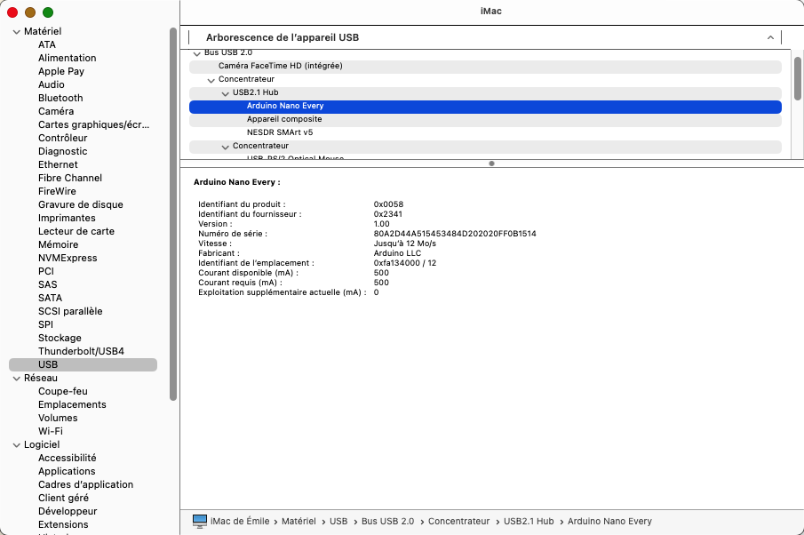
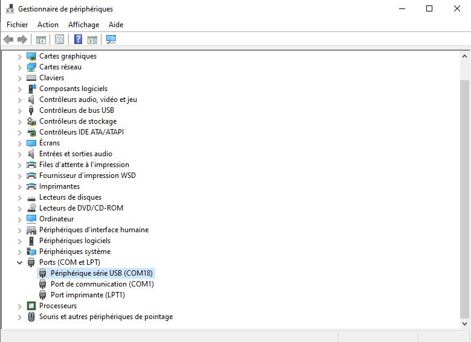

Trouver les ports assignés aux appareils connectés
-----------------------------------------------------

Les ordinateurs ont plusieurs manières de référer aux appareils connectés, selon l'application.
La méthode que nous utilisons est celle des ports, spécifiquement des ports série.
La façon de voir quels ports sont accessibles varie selon les plateformes.

Informations système sur MacOS
..................................

Sur MacOS, cherchez l'application :file:`Utilitaires/Informations système.app`. Naviguez à la section
:menuselection:`Matériel --> USB` et voyez la liste des connexions USB et les informations associées.
Les connexions série sont aussi visibles dans la section :menuselection:`Réseau --> Emplacements`.
Il manque par contre le nom d'appareil à utiliser avec la librairie.

Sur Windows, utilisez l'application ``Gestionnaire de périphériques`` pour voir la liste des appareils connectées.

Sur toutes les plateformes, vous pouvez utiliser la fonction :func:`print_ports` du module
:mod:`xphs1903.outils.serial`.

>>> from xphs1903.outils.serial import print_ports
>>> print_ports()
/dev/cu.S1	n/a	n/a
/dev/cu.ACCENTUMTW	n/a	n/a
/dev/cu.Bluetooth-Incoming-Port	n/a	n/a
/dev/cu.usbserial-210415BDFCD9	Digilent USB Device - Digilent USB Device	USB VID:PID=0403:6014 SER=210415BDFCD9 LOCATION=253-1.4.2
/dev/cu.usbmodemFA13401	Arduino Nano Every	USB VID:PID=2341:0058 SER=80A2D44A515453484D202020FF0B1514 LOCATION=250-1.3.4

